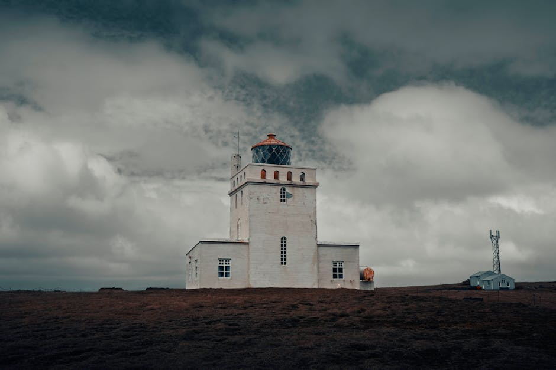

# Asbyrgi Canyon

**Category:** Nature & Landscapes (Coastal & Other Natural Features)

**Description:**
Asbyrgi is a unique, horseshoe-shaped canyon located in the northern part of Vatnajökull National Park. Measuring approximately 3.5 kilometers (2.2 miles) long and over 1 kilometer (0.6 miles) wide, it is surrounded by steep, 100-meter-high (328-foot) cliffs.

According to Norse mythology, the canyon was formed by the hoofprint of Odin's eight-legged horse, Sleipnir. Geologically, it is believed to have been carved by powerful glacial floods. The canyon floor features lush forests, tranquil ponds, and a variety of plant and bird life. A prominent feature is Eyjan, "The Island," a cliff rising from the center of the canyon.

**Things to Do:**
*   Hike the numerous trails within the canyon, including paths to Botnstjorn pond and to the top of Eyjan for panoramic views.
*   Enjoy the serene atmosphere and unique geological formations.
*   Birdwatch and appreciate the rare forested areas in Iceland.

**Image Placeholder:**

## Images

