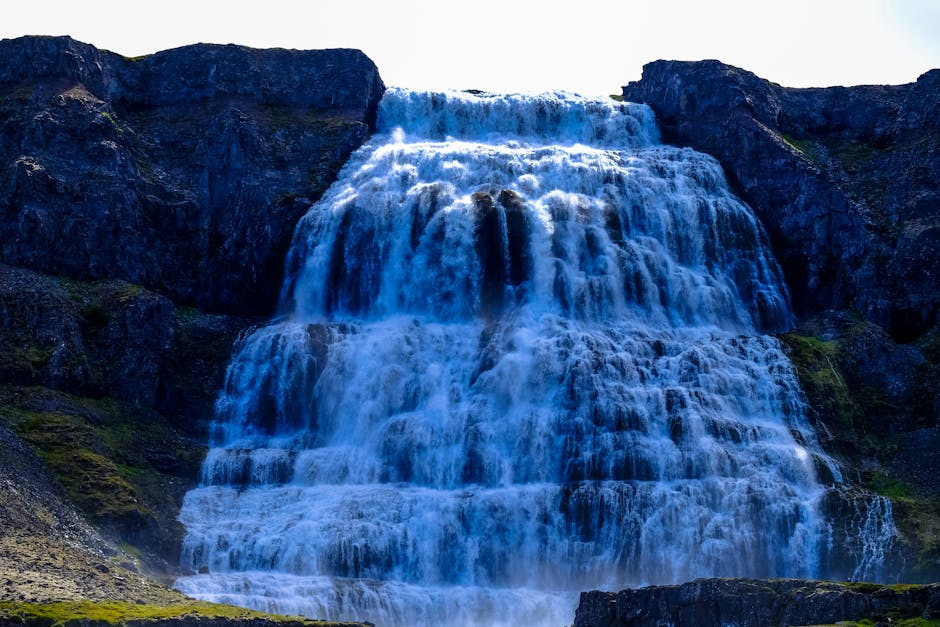
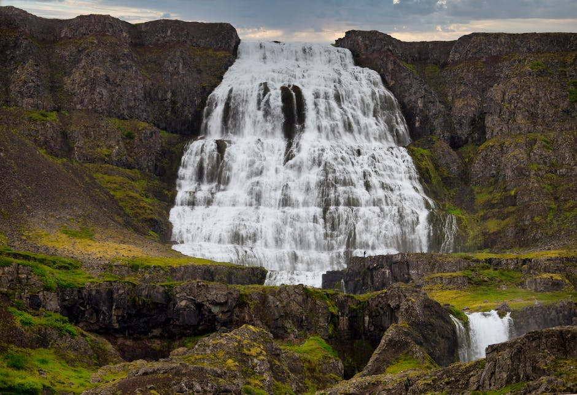
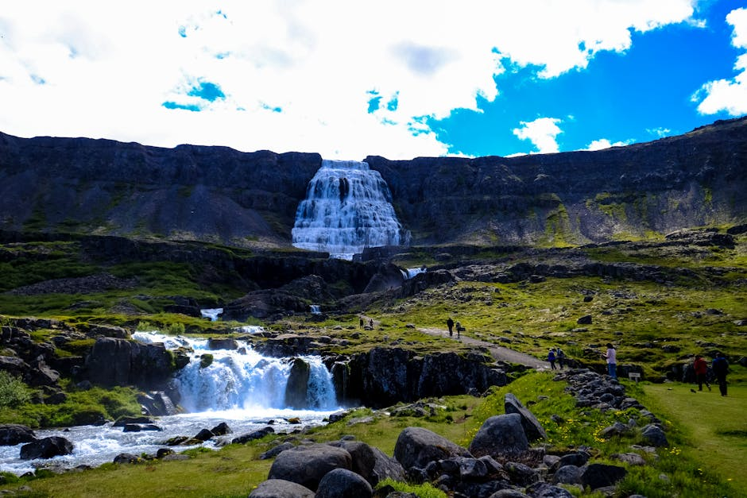

# Dynjandi Waterfall

**Category:** Nature & Landscapes (Waterfalls)

**Description:**
Dynjandi, meaning "thunderous," is a magnificent multi-tiered waterfall located in the remote Westfjords region of Iceland. It cascades down a mountainside in a broad, fan-like shape, making it one of Iceland's most unique and visually striking waterfalls. The main tier is approximately 30 meters wide at the top and spreads to about 60 meters at the base, with a total height of 100 meters (328 feet) through a series of smaller waterfalls.

The Westfjords offer a rugged and serene landscape, and Dynjandi is a true jewel of this less-visited area, embodying raw beauty and tranquility.

**Things to Do:**
*   Hike the scenic path from the base to the top of Dynjandi, passing several smaller waterfalls along the way.
*   Admire the unique fan-like shape and powerful flow.
*   Enjoy the breathtaking views of the fjords and surrounding wilderness.

**Image Placeholder:**

## Images

