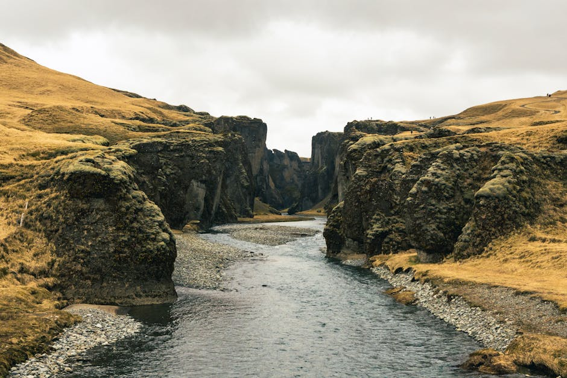
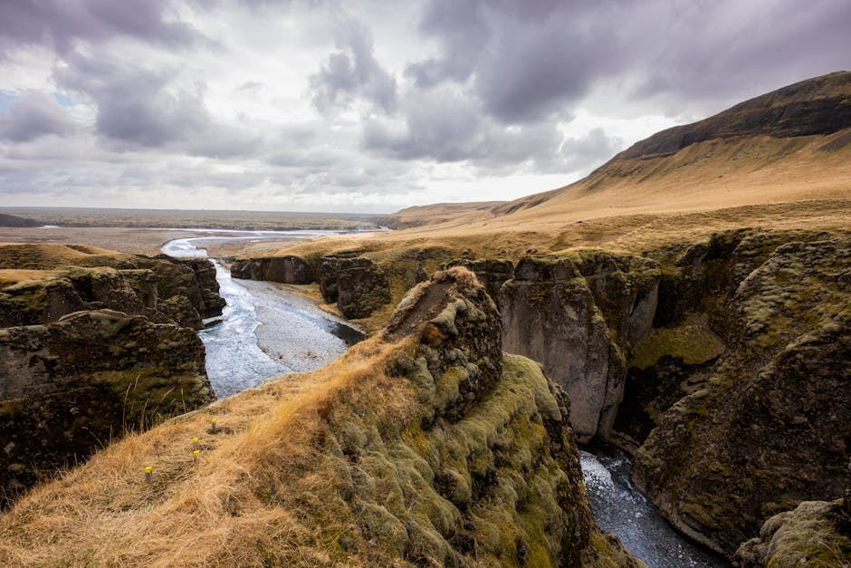
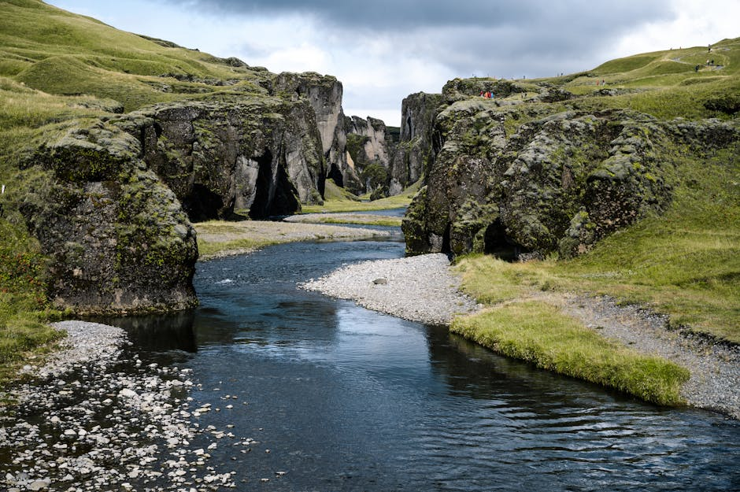

# Fjaðrárgljúfur Canyon

**Category:** Nature & Landscapes (Volcanic & Geothermal Areas / Canyons)

**Description:**
Fjaðrárgljúfur is a magnificent and ancient canyon located in southeast Iceland, near Kirkjubæjarklaustur. It is characterized by its twisting, snake-like shape and towering walls, which plunge about 100 meters (328 feet) deep and stretch for approximately 2 kilometers (1.2 miles). The canyon was formed during the last Ice Age by glacial meltwaters carving through the landscape.

The canyon walls are covered in vibrant green moss and grass, and the clear waters of the Fjaðrá river flow through its base, creating a truly picturesque and almost fairytale-like setting. It gained significant popularity after being featured in a well-known music video.

**Important Note:** To protect the fragile moss and delicate ecosystem, it's crucial to stick to marked paths and respect any closures. Off-trail walking can cause significant damage.

**Things to Do:**
*   Walk along the marked trails and viewpoints to admire the canyon's unique shape and lush vegetation.
*   Enjoy the serene atmosphere and photograph the stunning geological formations.
*   Listen to the sounds of the Fjaðrá river flowing through the canyon.

**Image Placeholder:**

## Images

