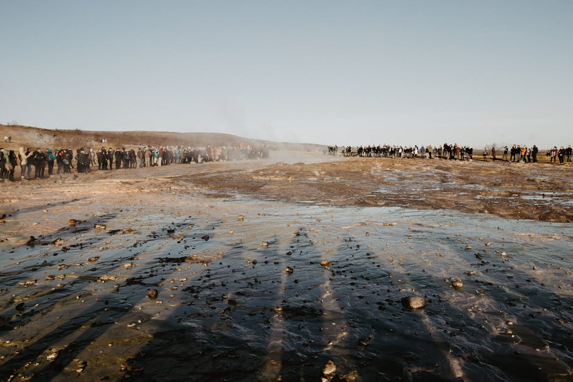
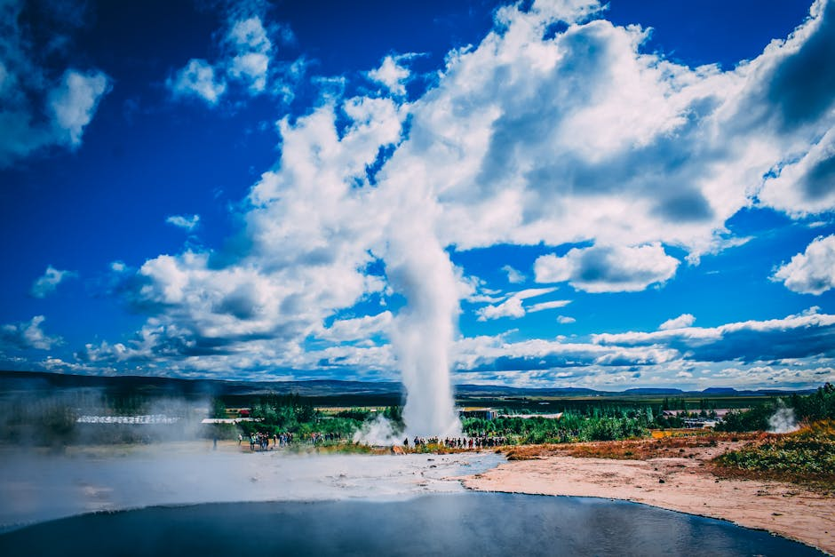
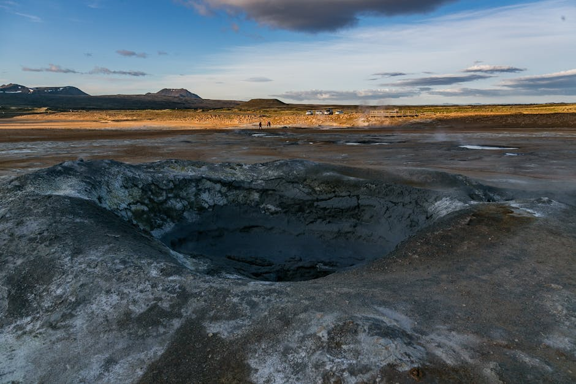

# Geysir Geothermal Area

**Category:** Nature & Landscapes (Golden Circle)

**Description:**
The Geysir Geothermal Area in the Haukadalur valley is a prime example of Iceland's intense geothermal activity. This is the place that gave the world the word "geyser." While the Great Geysir itself is mostly dormant now, its neighboring geyser, Strokkur, erupts reliably every 5-10 minutes, shooting hot water high into the air, providing a spectacular show for visitors.

The area is characterized by steaming vents, bubbling mud pools, and the strong scent of sulfur, all indicative of the powerful forces at work beneath the earth's surface.

**Things to Do:**
*   Witness the regular eruptions of Strokkur geyser.
*   Explore the various hot springs, fumaroles, and mud pots.
*   Learn about the geology and geothermal power of Iceland.

**Image Placeholder:**

## Images

