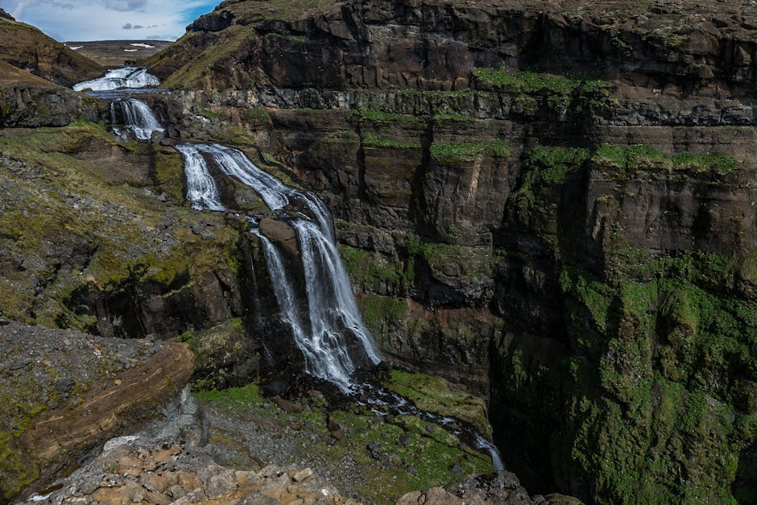

# Glymur Waterfall

**Category:** Nature & Landscapes (Waterfalls)

**Description:**
Glymur is Iceland's second-highest waterfall, with a total drop of 198 meters (650 feet), located in the scenic Hvalfjörður fjord. Once considered the highest until the discovery of Morsárfoss, Glymur remains a spectacular natural wonder and a popular destination for hikers.

The hike to Glymur is an adventure in itself, involving river crossings (often via a log bridge or by wading), steep ascents, and stunning views of the canyon and surrounding landscape. It offers a more challenging and rewarding experience compared to some of the more accessible waterfalls.

**Things to Do:**
*   Embark on the challenging but highly rewarding hike to the waterfall (allow 3-4 hours round trip).
*   Cross the river on a log or by wading (seasonal, check conditions).
*   Enjoy panoramic views of the waterfall and the lush Hvalfjörður canyon.
*   Connect with nature away from more crowded tourist spots.

**Image Placeholder:**

## Images

