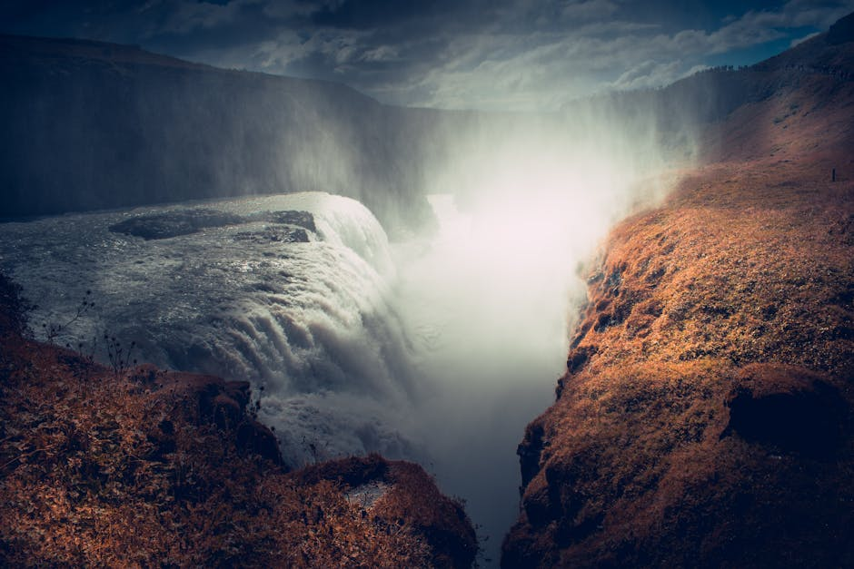

# Gullfoss Waterfall

**Category:** Nature & Landscapes (Golden Circle)

**Description:**
Gullfoss, meaning "Golden Falls," is one of Iceland's most iconic and powerful waterfalls, located in the Hvítá river canyon. The water cascades down two distinct drops, totaling 32 meters (105 feet), into a deep gorge. The sheer volume of water and the mist it creates often result in beautiful rainbows on sunny days, giving the waterfall its name.

It is a significant part of the famous Golden Circle route and is impressive in all seasons, whether surrounded by summer greenery or winter snow and ice.

**Things to Do:**
*   View the waterfall from multiple platforms, including one close to the falls where you can feel the spray.
*   Photograph the powerful cascades and potential rainbows.
*   Learn about the history and folklore surrounding the waterfall.

**Image Placeholder:**

## Images

