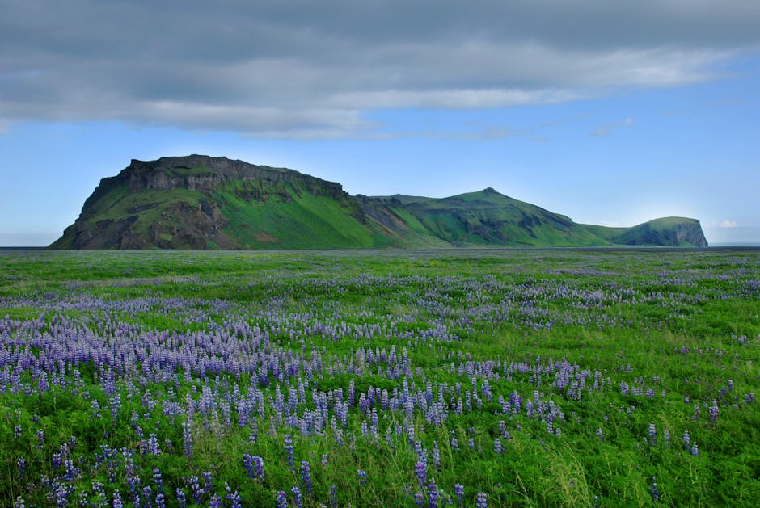

# Hekla Volcano

**Category:** Nature & Landscapes (Volcanic & Geothermal Areas)

**Description:**
Hekla is one of Iceland's most famous and active volcanoes, located in the southern part of the country. Historically, it was referred to in medieval texts as the "Gateway to Hell" due to its frequent and often dramatic eruptions. Since 874 AD, there have been over 20 recorded eruptions.

The volcano is surrounded by a vast and rugged lava field, creating a unique and stark landscape. While hiking to the summit can be challenging and depends on current volcanic activity, the area offers impressive views of glaciers, geysers, and other volcanic peaks.

**Things to Do:**
*   Explore the surrounding lava fields (check safety conditions and official warnings before visiting).
*   Consider a super jeep tour to access remote parts of the area.
*   Visit the Hekla Center for exhibits on the volcano's history and geology.
*   For experienced hikers, consider a guided hike to the summit, if conditions allow.

**Image Placeholder:**

## Images

