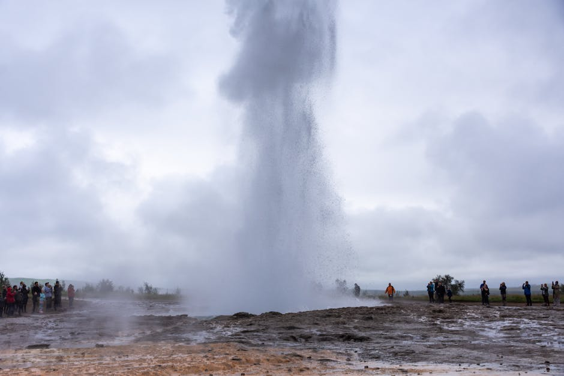
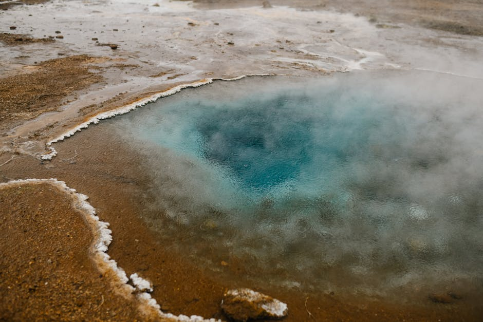
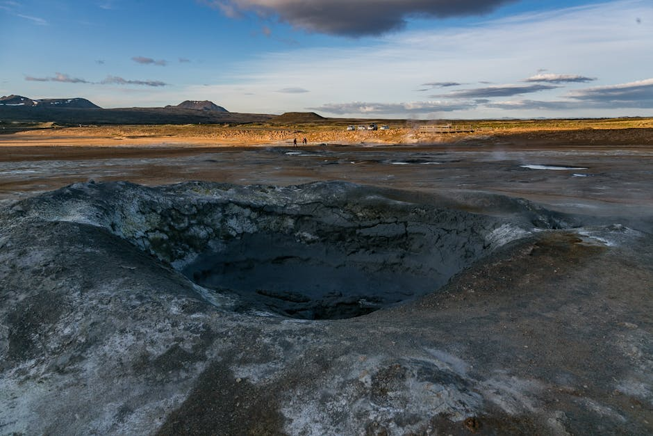

# Hvammsvik Hot Springs

**Category:** Nature & Landscapes (Volcanic & Geothermal Areas)

**Description:**
Hvammsvik Hot Springs are a relatively new and increasingly popular geothermal bathing spot located on the shores of Hvalfjörður (Whale Fjord), offering a more rustic and secluded experience compared to larger spas. These hot springs blend seamlessly with their natural surroundings, providing a tranquil escape with stunning fjord views.

The unique setting allows visitors to move between several pools of varying temperatures, some right at the ocean's edge, with the opportunity to dip into the cold fjord water for a refreshing contrast.

**Things to Do:**
*   Relax in the various geothermal pools with different temperatures.
*   Enjoy the serene fjord views and natural setting.
*   Experience the contrast of warm springs and cold ocean dips.
*   Appreciate the peaceful atmosphere away from more crowded tourist spots.

**Image Placeholder:**

## Images

