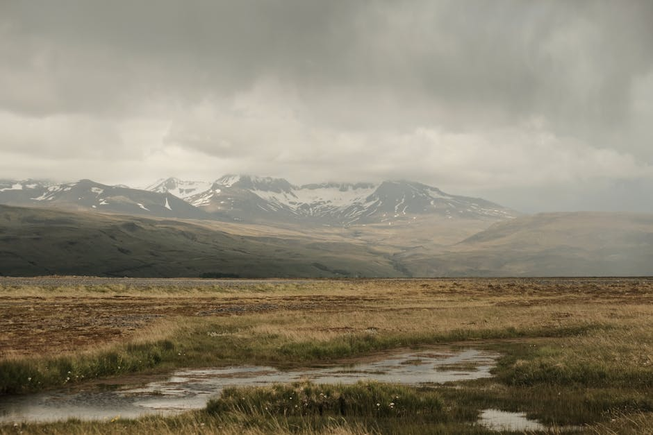
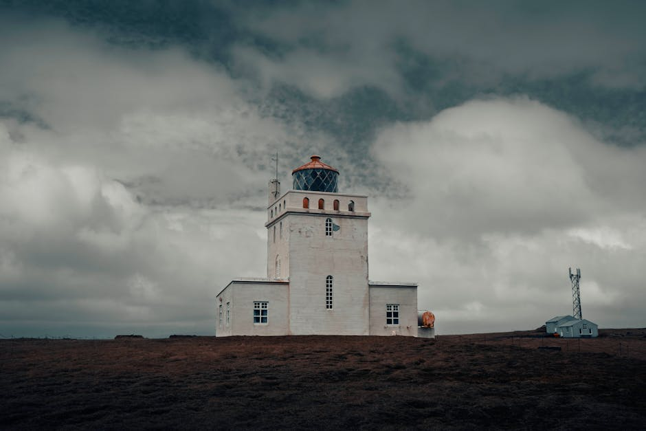
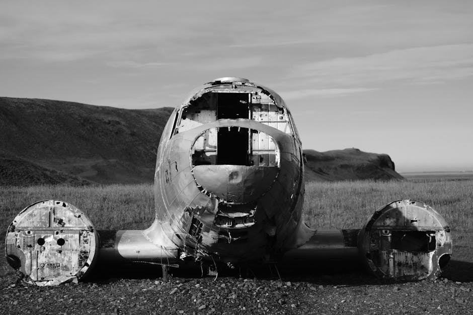

# Krysuvikurbjarg Cliffs

**Category:** Nature & Landscapes (Coastal & Other Natural Features)

**Description:**
Krysuvikurbjarg is a dramatic cliffside area located on the Reykjanes peninsula in southwest Iceland. These towering cliffs rise sharply from the Atlantic Ocean, reaching heights of around 40 meters (131 feet), offering breathtaking panoramic views of the rugged coastline and the open sea. The area's unique geology, shaped by volcanic activity, adds to its stark beauty.

Krysuvikurbjarg is particularly popular among birdwatchers during the spring and summer months, as it becomes a significant nesting ground for various seabirds, including guillemots, kittiwakes, and razorbills.

**Things to Do:**
*   Enjoy the dramatic coastal scenery and ocean views.
*   Go birdwatching, especially during nesting season (seasonal).
*   Hike along the cliff tops (exercise caution near edges).
*   Explore other geothermal areas on the Reykjanes peninsula.

**Image Placeholder:**

## Images

