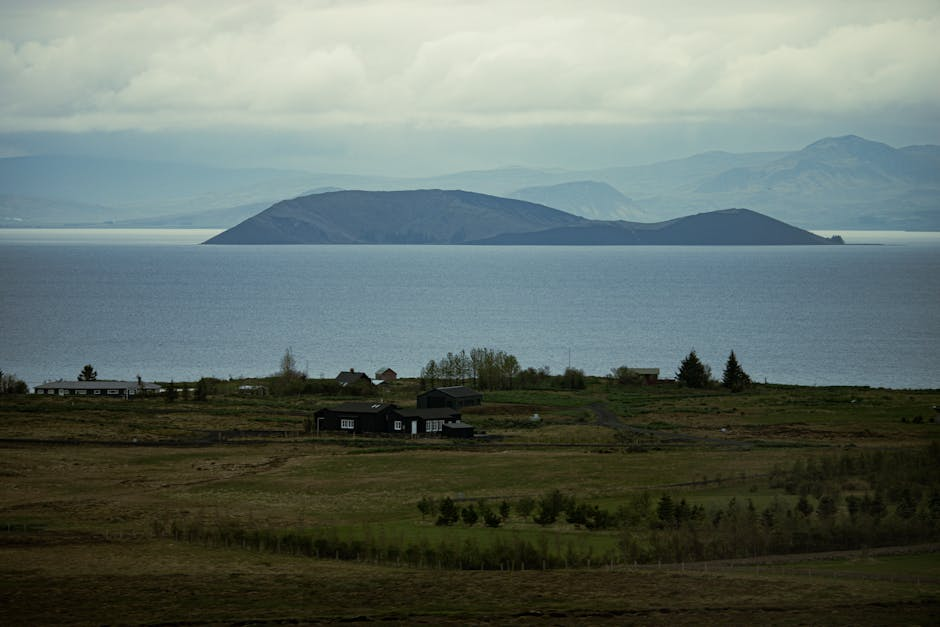

# Lake Mývatn

**Category:** Nature & Landscapes (Volcanic & Geothermal Areas)

**Description:**
Lake Mývatn, located in northern Iceland, is a unique geological wonderland shaped by thousands of years of volcanic activity. The area surrounding the lake is characterized by diverse and surreal landscapes, including volcanic craters, bizarre lava formations, bubbling mud pools, and steaming vents.

Mývatn is also a significant birdwatching destination, particularly in summer, hosting numerous species of ducks and other waterfowl.

**Things to Do:**
*   Explore the **Dimmuborgir** lava formations, a field of uniquely shaped lava pillars and arches.
*   Visit the **Skútustaðagígar** pseudocraters, formed by steam explosions.
*   Take a relaxing dip in the **Mývatn Nature Baths**, a geothermal spa similar to the Blue Lagoon but often less crowded.
*   Observe the geothermal activity at **Námaskarð**, with its vibrant colors, boiling mud pots, and fumaroles.
*   Hike up **Hverfjall crater** for panoramic views of the lake and surrounding area.
*   Explore the Krafla area, including **Leirhnjúkur** lava field and **Viti crater lake**.
*   Go birdwatching around the lake, especially in summer.

**Image Placeholder:**

## Images

