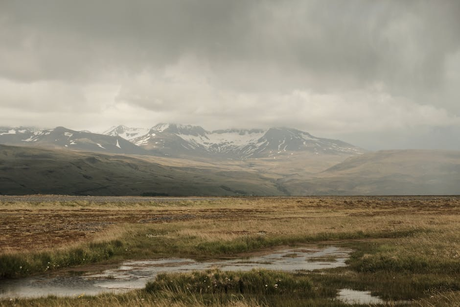

# Laugarvatn Fontana

**Category:** Nature & Landscapes (Volcanic & Geothermal Areas)

**Description:**
Laugarvatn Fontana is a modern geothermal spa located on the shores of Lake Laugarvatn, right in the heart of the Golden Circle route. It offers a unique bathing experience with various interconnected geothermal pools and steam baths built directly over natural hot springs. The natural steam rooms provide a pure and humid heat, and brave visitors can take a refreshing dip in the cool waters of Lake Laugarvatn between soaks.

Fontana is also famous for its geothermal bakery, where traditional Icelandic rye bread is baked in the hot sands heated by the geothermal activity beneath the ground.

**Things to Do:**
*   Relax in the geothermal pools and steam baths.
*   Experience the invigorating cold plunge in Lake Laugarvatn.
*   Taste freshly baked geothermal rye bread.
*   Enjoy the serene lake views.

**Image Placeholder:**

## Images

