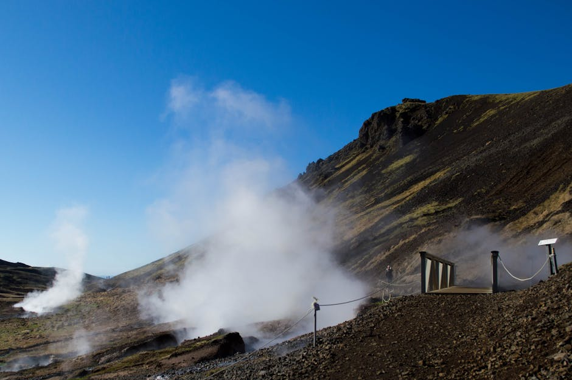
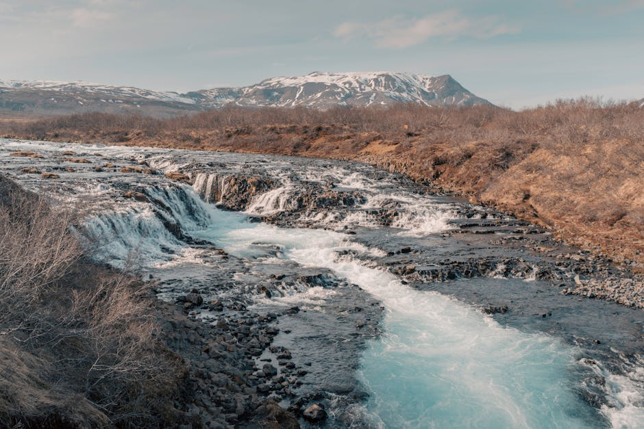
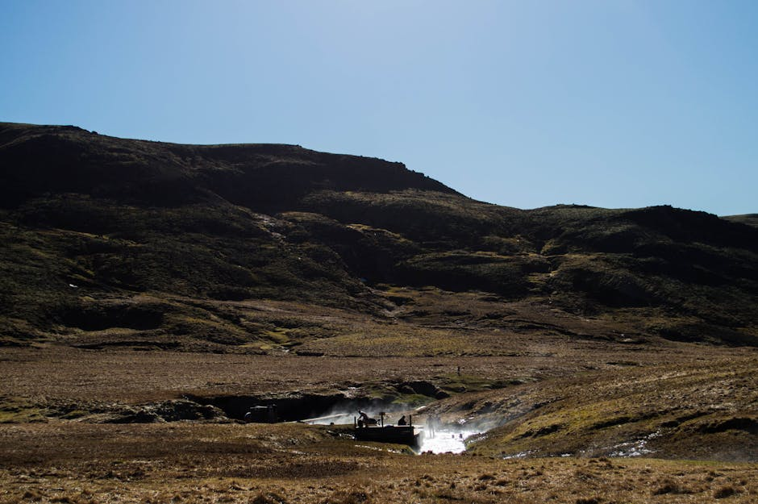

# Reykjadalur Valley (Hot Spring River)

**Category:** Nature & Landscapes (Volcanic & Geothermal Areas)

**Description:**
Reykjadalur, often called the "Steam Valley," is a geothermal area located near the town of Hveragerði in South Iceland, easily accessible from Reykjavik. It is famous for its natural hot spring river where visitors can bathe and relax in naturally heated waters flowing down a scenic valley.

The hike to the bathing area is relatively moderate and offers stunning views of steaming hot springs, mud pools, and lush green hillsides, making it a unique outdoor experience.

**Things to Do:**
*   Hike through the beautiful geothermal valley to reach the hot spring river.
*   Bathe in the warm sections of the river.
*   Enjoy the scenic views of steam vents and boiling mud pots along the trail.

**Image Placeholder:**

## Images

