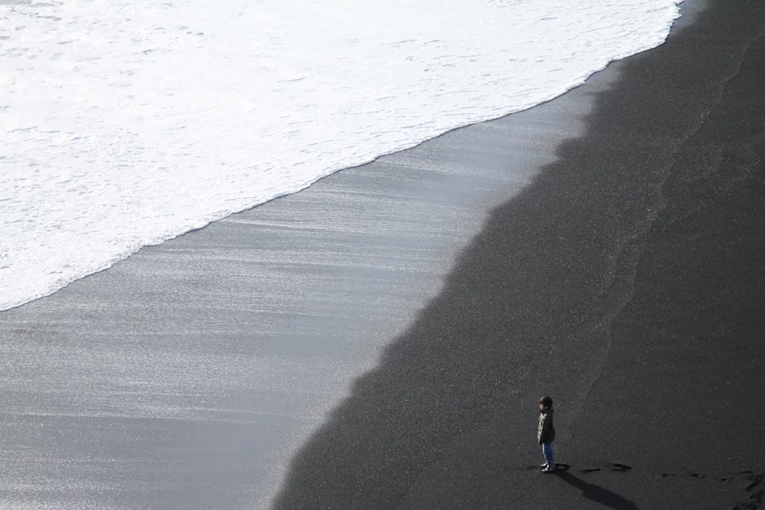
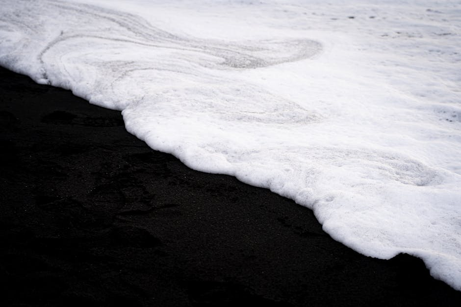
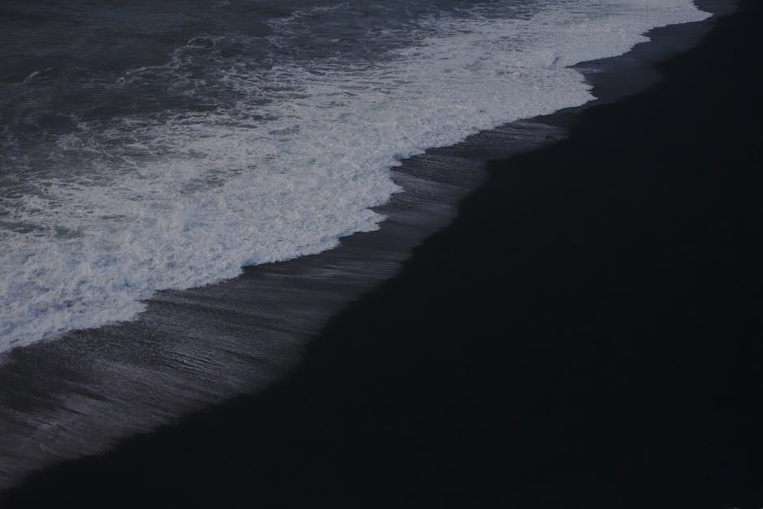

# Reynisfjara (Black Sand Beach)

**Category:** Nature & Landscapes (Coastal & Other Natural Features)

**Description:**
Reynisfjara is Iceland's most famous black sand beach, located on the South Coast near the village of Vík í Mýrdal. Its distinctive jet-black volcanic sand, powerful Atlantic waves, and dramatic rock formations create an otherworldly and breathtaking landscape. The beach is backed by impressive hexagonal basalt columns called Gardar, which resemble a natural pyramid.

Offshore, the Reynisdrangar sea stacks rise majestically from the ocean. According to Icelandic folklore, these were once trolls caught by the rising sun and turned into stone.

**Important Safety Note:** Reynisfjara is known for its dangerous and unpredictable "sneaker waves" that can suddenly sweep people out to sea. Always keep a safe distance from the water's edge and never turn your back on the ocean.

**Things to Do:**
*   Admire and photograph the black sand and basalt columns.
*   Observe the Reynisdrangar sea stacks.
*   Enjoy birdwatching, especially puffins nesting on the cliffs during summer.
*   Be highly aware of and respect the powerful waves for your safety.

**Image Placeholder:**

## Images

