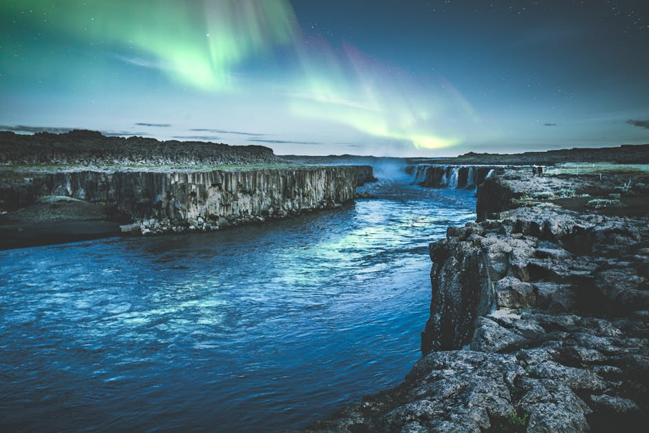

# Seljalandsfoss Waterfall

**Category:** Nature & Landscapes (Waterfalls)

**Description:**
Seljalandsfoss is one of Iceland's most famous waterfalls, located on the South Coast. What makes it particularly unique is a pathway that allows visitors to walk completely behind the cascading water, offering a truly immersive and memorable experience. The waterfall plunges 60 meters (197 feet) over a former coastline cliff.

Be prepared to get a little wet from the spray, especially if you venture behind the falls! It's a beautiful sight that changes with the seasons.

**Things to Do:**
*   Walk the path behind the waterfall for a unique perspective.
*   Photograph the falls from various angles.
*   Explore the surrounding area and nearby smaller waterfalls.

**Image Placeholder:**

## Images

