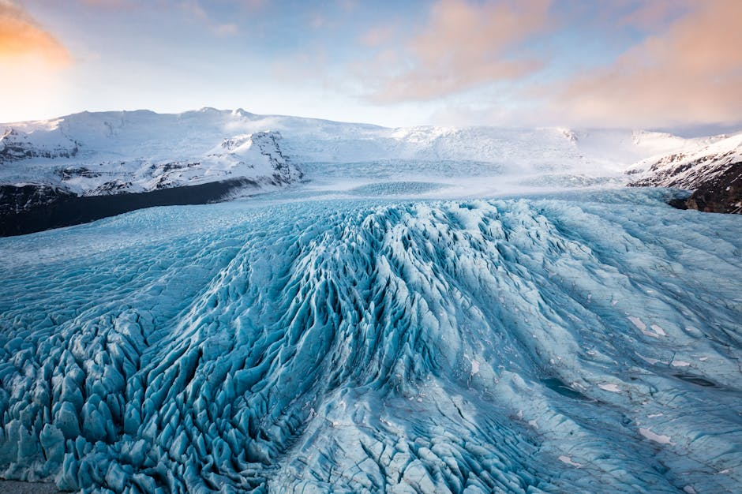
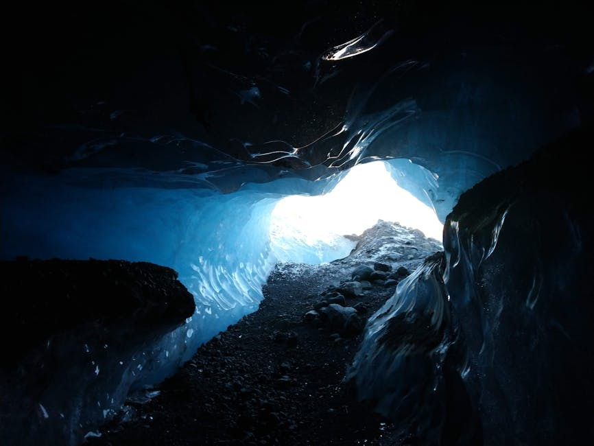
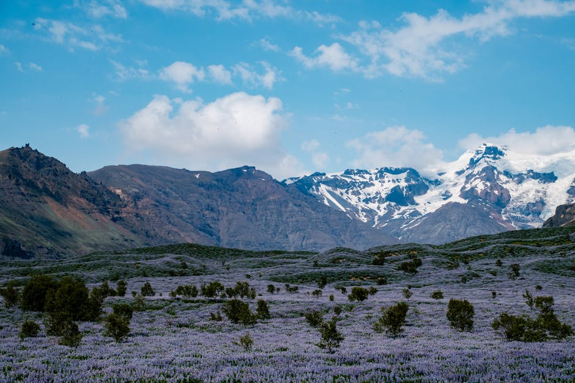

# Skaftafell Nature Reserve

**Category:** Nature & Landscapes (Glaciers & Ice Formations)

**Description:**
Skaftafell Nature Reserve is a stunning area located within Vatnajökull National Park in southeastern Iceland. It is a true outdoor paradise, offering a diverse range of landscapes from glaciers and black-sand plains to mountains and waterfalls. Skaftafell was formerly a national park on its own and is known for its remarkably pleasant climate, often milder than other parts of Iceland.

The reserve is a popular destination for hikers, with trails ranging from easy strolls to more challenging treks up to the foot of glaciers. One of its highlights is Svartifoss waterfall, famous for its basalt columns.

**Things to Do:**
*   Hike various trails, including the popular path to Svartifoss waterfall.
*   Join guided glacier hikes on the Skaftafell glacier.
*   Explore the diverse ecosystems and geological formations.
*   Keep an eye out for local wildlife, including the Arctic fox.

**Image Placeholder:**

## Images

