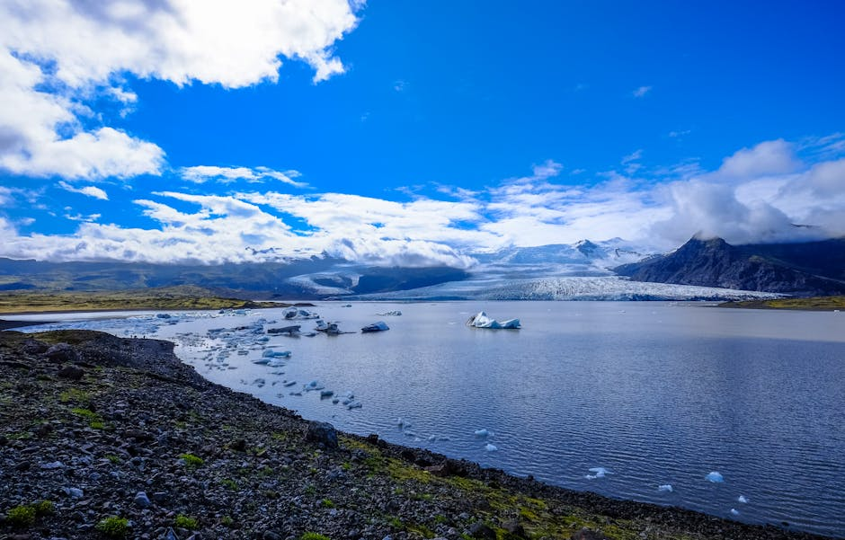
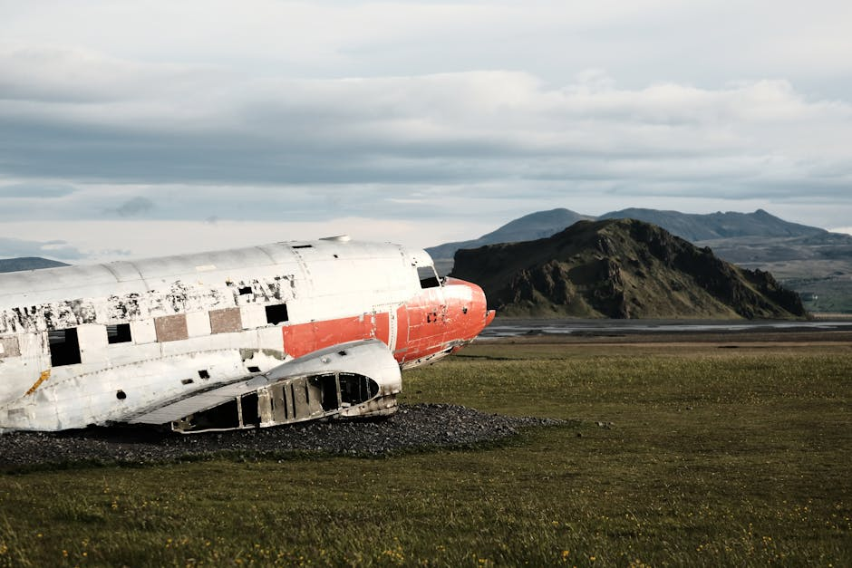
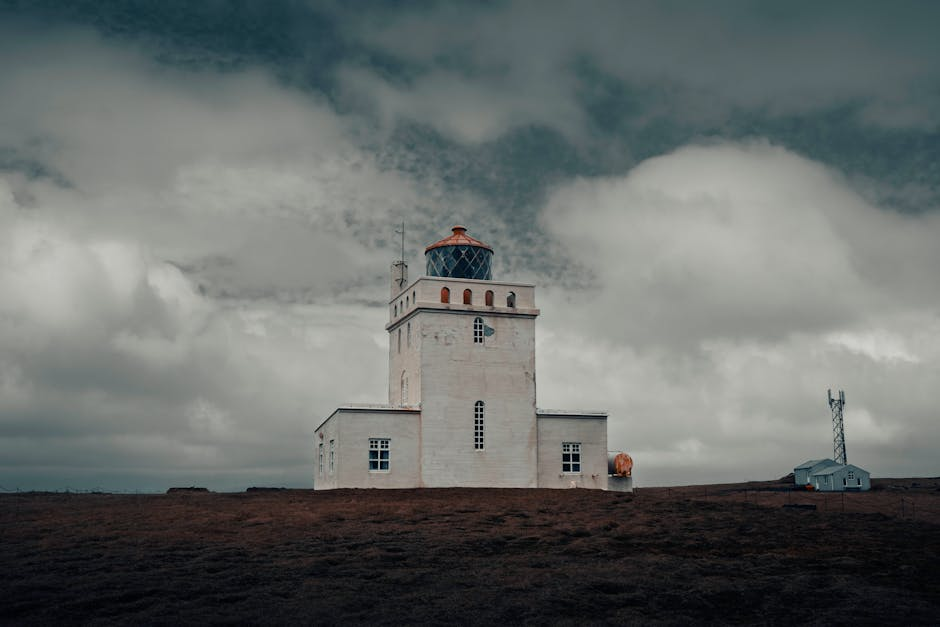

# Sky Lagoon

**Category:** Nature & Landscapes (Volcanic & Geothermal Areas)

**Description:**
Sky Lagoon is an upscale geothermal spa conveniently located near downtown Reykjavik, offering a luxurious and relaxing experience with stunning views. Carved into the dramatic lava cliffs, its infinity-edge pool overlooks the Atlantic Ocean, creating a serene and picturesque setting.

Sky Lagoon is known for its unique seven-step ritual, which includes various complementary treatments like a cold plunge, sauna, cold mist, and a salt scrub, designed to rejuvenate the body and mind.

**Things to Do:**
*   Relax in the warm, geothermal infinity pool with ocean views.
*   Experience the invigorating seven-step ritual.
*   Enjoy drinks at the swim-up bar.
*   Witness the sunset or potentially the Northern Lights (seasonal) from the lagoon.

**Image Placeholder:**

## Images

