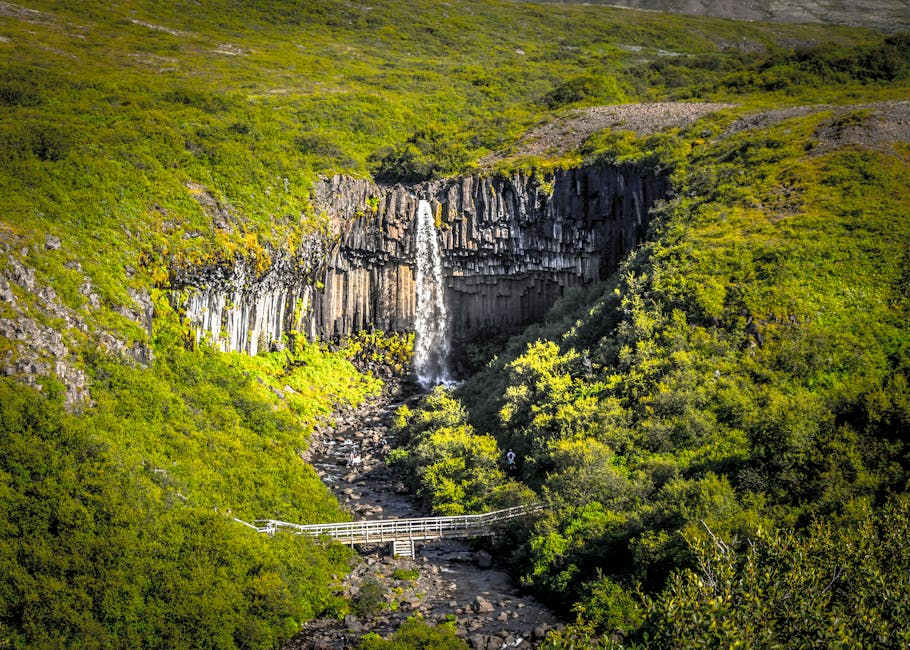
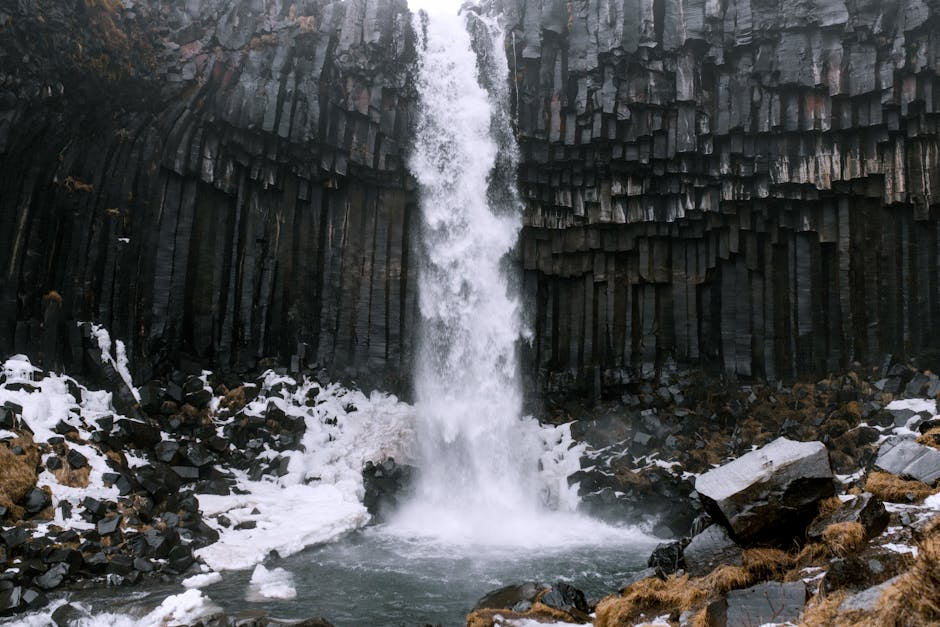
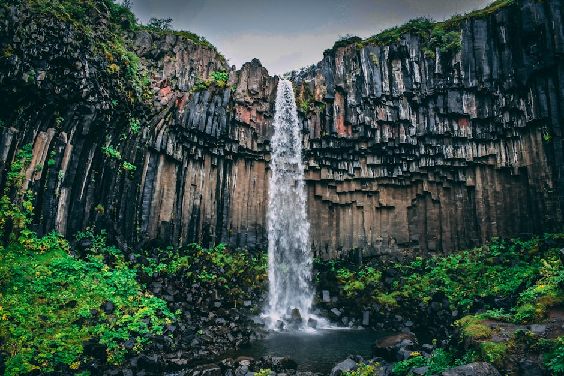

# Svartifoss Waterfall

**Category:** Nature & Landscapes (Waterfalls)

**Description:**
Svartifoss, meaning "Black Falls," is a distinctive waterfall located in Skaftafell Nature Reserve (part of Vatnajökull National Park) in South Iceland. It's renowned for the hexagonal basalt columns that frame the waterfall, resembling a giant pipe organ. These columns were formed when lava flows cooled slowly.

The unique geological formation has inspired Icelandic architects, including the design of Hallgrímskirkja church in Reykjavik.

**Things to Do:**
*   Hike to the waterfall, enjoying the scenic trails of Skaftafell.
*   Admire and photograph the unique basalt columns.
*   Explore the Skaftafell Nature Reserve, known for its diverse landscapes.

**Image Placeholder:**

## Images

