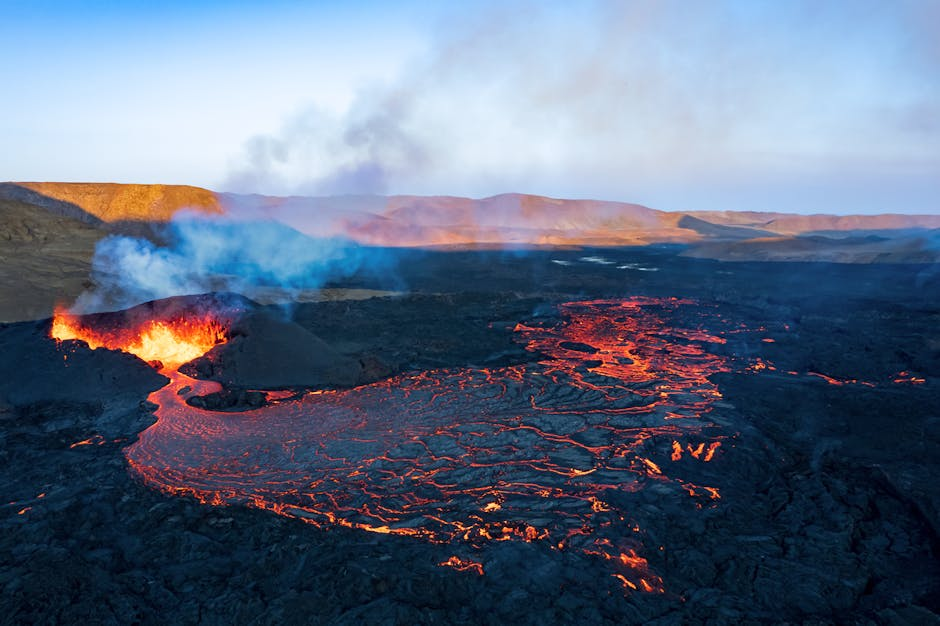
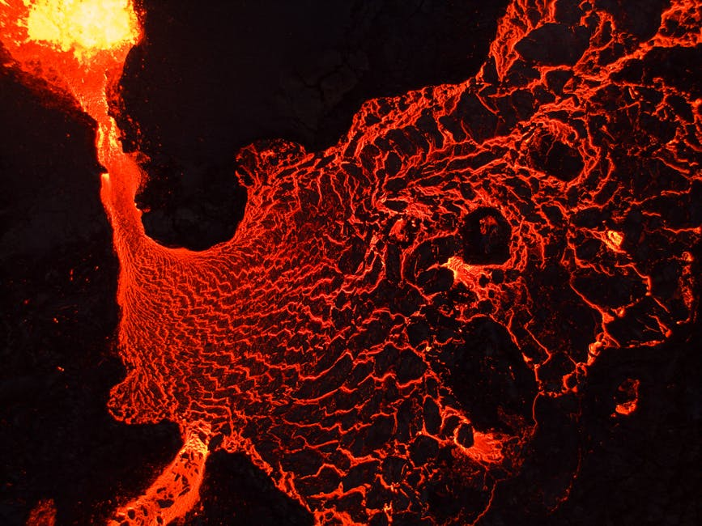
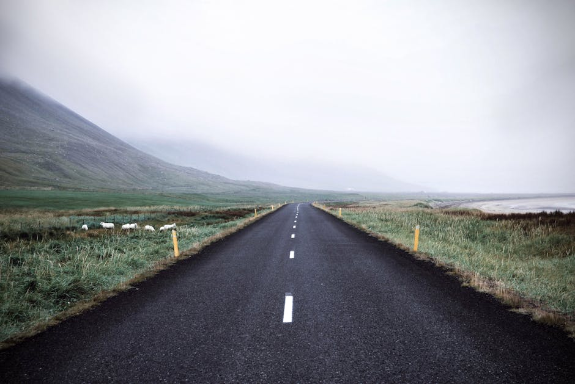

# Thrihnukagigur Volcano

**Category:** Nature & Landscapes (Volcanic & Geothermal Areas)

**Description:**
Thrihnukagigur is a dormant volcano near Reykjavik, famous for being the only place in the world where you can take an elevator down into its vast and colorful magma chamber. The volcano last erupted over 4,000 years ago, and its magma chamber is now empty, revealing stunning rock formations in vibrant shades of red, blue, yellow, and orange.

This unique tour offers an extraordinary glimpse into the Earth's interior, providing a truly once-in-a-lifetime experience.

**Things to Do:**
*   Descend into the magma chamber via an open elevator.
*   Explore the colorful interior of the volcano.
*   Hike across the lava fields to reach the volcano's entrance.

**Image Placeholder:**

## Images

