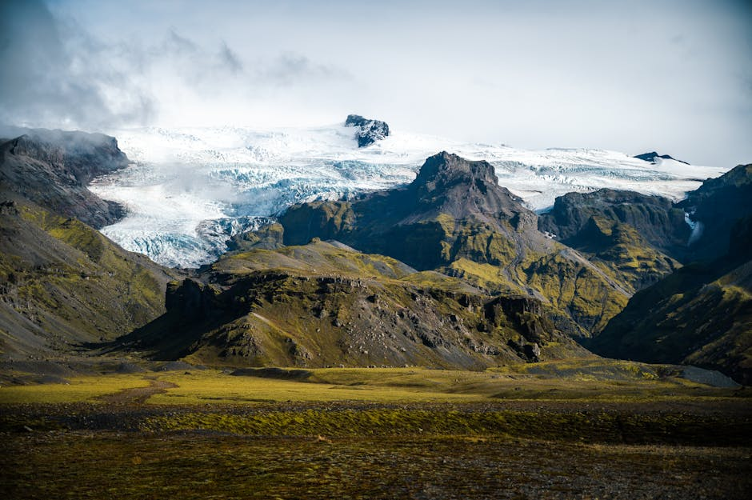
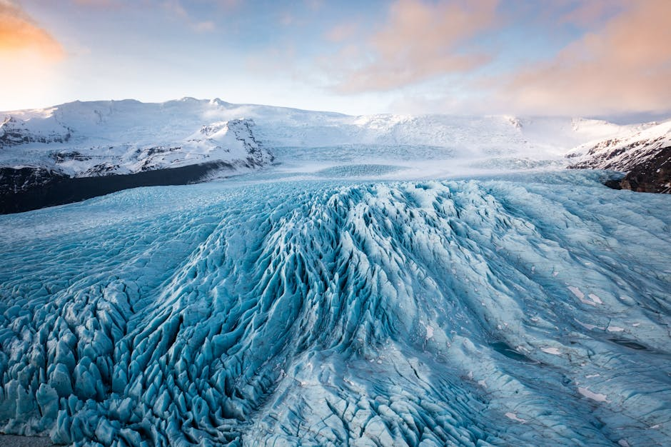
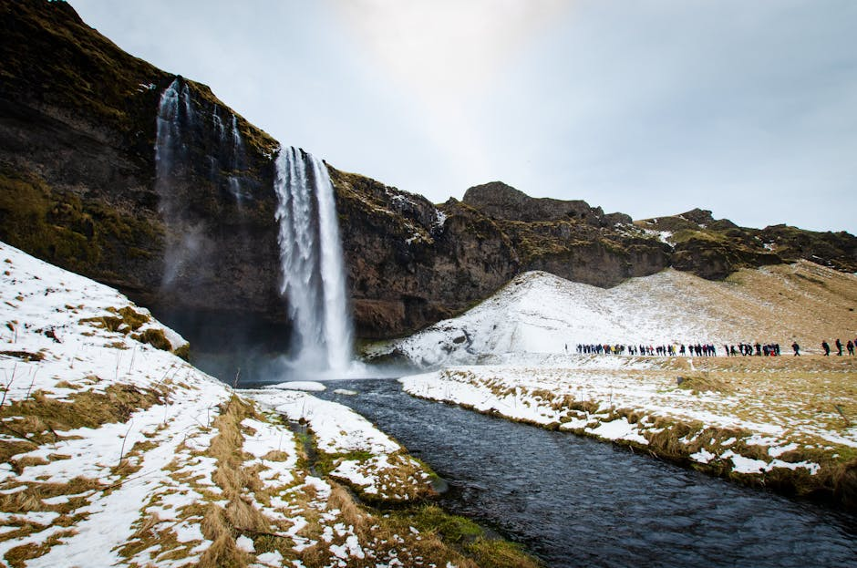

# Vatnajökull National Park

**Category:** Nature & Landscapes (Glaciers & Ice Formations)

**Description:**
Vatnajökull National Park is the largest national park in Iceland and one of the largest in Europe, covering approximately 14% of the country's total land area. It is a UNESCO World Heritage Site, renowned for its extraordinary diversity of landscapes, which are shaped by the opposing forces of volcanic activity and glacial ice.

The park is dominated by Vatnajökull, Europe's second-largest ice cap, which is up to a kilometer thick in places. Beneath the glacier, there are active volcanoes, creating a unique environment where fire and ice coexist. The park also features dramatic canyons, powerful waterfalls, vast glacial rivers, and striking ice caves.

**Things to Do:**
*   Go glacier hiking or ice climbing on Vatnajökull.
*   Explore natural ice caves (seasonal, typically winter).
*   Visit Skaftafell Nature Reserve within the park for hiking trails and Svartifoss waterfall.
*   See Jökulsárlón glacier lagoon and Diamond Beach, which are fed by the glacier.
*   Consider a snowmobile tour across the ice cap.
*   Hike Hvannadalshnúkur, Iceland's highest peak (for experienced climbers).

**Image Placeholder:**

## Images

