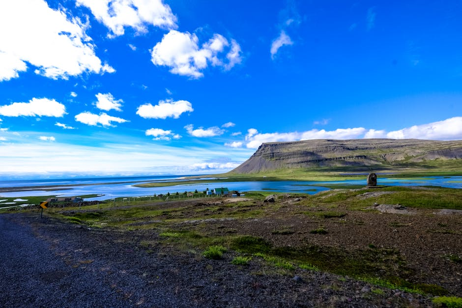
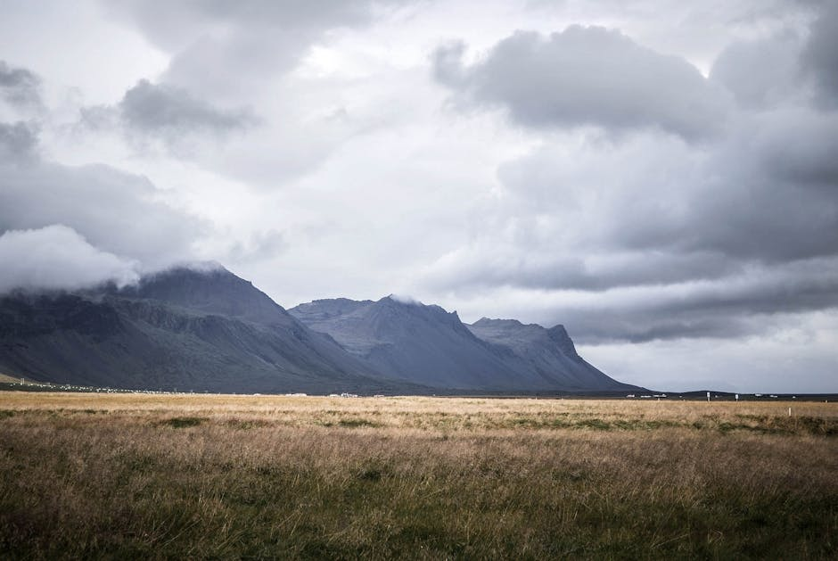

# Westfjords

**Category:** Nature & Landscapes (Coastal & Other Natural Features)

**Description:**
The Westfjords is a large, mountainous peninsula in northwestern Iceland, characterized by its dramatic fjords, steep cliffs, and untouched wilderness. It is one of Iceland's most remote and least populated regions, offering a sense of raw, untamed beauty and tranquility away from the more well-trodden tourist paths.

The region is known for its incredible birdlife, particularly at the Látrabjarg bird cliffs, and for unique natural attractions like the Dynjandi waterfall. Its isolation has helped preserve its stunning landscapes and rich cultural heritage.

**Things to Do:**
*   Visit **Dynjandi waterfall**, the multi-tiered "Jewel of the Westfjords."
*   Explore **Látrabjarg bird cliffs**, one of Europe's largest bird cliffs, home to millions of seabirds including puffins (in summer).
*   Relax in secluded hot pots and natural geothermal pools.
*   Discover charming fishing villages and local culture.
*   Hike through spectacular fjord landscapes.
*   Look for Arctic foxes, especially in Hornstrandir Nature Reserve.

**Image Placeholder:**

## Images

